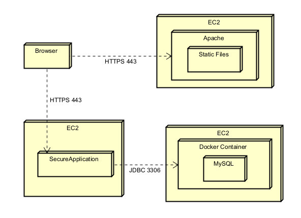
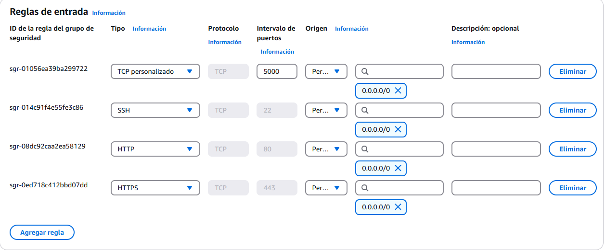

# Taller 6 | AREP

## Secure Application Design

In this project, we will design and deploy a secure web application using AWS infrastructure. The system consists of two main components:

- Apache Server (Frontend): Serves an asynchronous HTML+JavaScript client over a secure TLS connection, ensuring encrypted communication.
- Spring Boot Server (Backend): Provides RESTful API endpoints, also secured with TLS, to handle client requests and authentication.

The entire application is deployed on AWS, with each service running on separate EC2 instances. TLS certificates from Let’s Encrypt are used to encrypt all data transmissions. The login system is implemented with hashed password storage, ensuring user data security. This architecture prioritizes scalability, security, and best practices for cloud deployment.

## Architecture
The architecture of this project follows a distributed deployment model using AWS EC2 instances. It consists of three main components:

- Browser: Users interact with the system through a web browser, sending HTTPS requests to access static files or communicate with the secure application.
- Static Files Server: An EC2 instance runs an Apache server that serves static files. The browser connects to this server over HTTPS (port 443).
- Secure Application: A Spring Boot application runs on a separate EC2 instance, handling business logic, processing user requests, and communicating with the database. The browser interacts with this application via HTTPS (port 443).
- Database: A MySQL database runs inside a Docker container on a dedicated EC2 instance. The secure application connects to this database using JDBC over port 3306.

This setup ensures scalability, security, and separation of concerns, enabling efficient handling of static content, dynamic processing, and data storage.



## Class Design

```
src/main/java
└── co.edu.eci
    ├── config
    │   └── SecurityConfig.java
    ├── controller
    │   ├── PropertyController.java
    │   └── UserController.java
    ├── model
    │   ├── Property.java
    │   └── User.java
    ├── repository
    │   ├── PropertyRepository.java
    │   └── UserRepository.java
    ├── service
    │   ├── PropertyService.java
    │   └── UserService.java
    └── Secureweb.java                      # Main Class

src/main/resources
    ├── images/                             # Resources for README file
    ├── static/                             # Not used
    ├── keystore/            
    │   └── keystore.p12
    └── application.properties

src/test/java
└── co.edu.eci
    └── PropertyControllerTest.java         # Unit Test

pom.xml
README.md
```

## Secure Login with Hashing

This system safeguards user passwords by utilizing hashing techniques, eliminating the need to store them in plain text. We implement the `BCrypt` algorithm, a robust and widely adopted password hashing function that integrates a salt to defend against rainbow table attacks.

When a user registers or updates their password, the system applies `BCrypt` hashing before saving it in the database. This approach ensures that even if the database is compromised, retrieving or decrypting the actual passwords remains extremely difficult.

During authentication, the entered password is hashed and compared with the stored hash to verify user credentials securely.

## Getting Started

These instructions will allow you to get a working copy of the project on your local machine for development and testing purposes.

### Prerequisites

- [Java](https://www.oracle.com/co/java/technologies/downloads/) 17 or higher.
- [Maven](https://maven.apache.org/download.cgi). 3.8.1 o higher.
- [AWS](https://aws.amazon.com/). Account
- [Git](https://git-scm.com/downloads) (optional).
- Web Browser.

To check if installed, run:

```
java -version
```
```
mvn --version
```
```
docker --version
```
```
git --version
```

### Installing

1. Download the repository from GitHub in a .zip or clone it to your local machine using Git.

    ```
    git clone https://github.com/jcontreras2693/AREP-Lab6.git
    ```

2. Navigate to the project directory.

    ```
    cd AREP-Lab6
    ```

3. Build the project by running the following command:

    ```
    mvn clean install
    ```

   

## Deployment

### EC2 Database Creation

1. Create a default EC2 instance on AWS and add a new Security Rule on the Security Group of the instance.

   

2. Connect to the EC2 instance, install docker with these commands:

    ```
    sudo yum update -y
    sudo yum install docker
    ```

3. Create and install a MySQL image on Docker, this will be our Database:

    ```
    docker run --name mysql-container -e MYSQL_ROOT_PASSWORD=root -e MYSQL_DATABASE=properties_db -p 3306:3306 -d mysql
    ```

4. You can get into the database in the container (password: root) with the command:

    ```
    docker exec -it mysql-container mysql -u root -p
    ```

5. Create a new table for the users and passwords:

    ```
    CREATE TABLE users (
    id BIGINT AUTO_INCREMENT PRIMARY KEY,
    username VARCHAR(255) NOT NULL UNIQUE,
    password CHAR(60) NOT NULL
    );
    ```

### EC2 Application Creation

1. Create a new default EC2 instance on AWS and add a new Security Rule on the Security Group of the instance.:

   

2. Replace this line on the `application.properties` file:

    ```
    spring.datasource.url=jdbc:mysql://your-EC2-DB-public-IP:3306/properties_db
    ```

3. Using [Duck DNS](https://www.duckdns.org) generate a static domain for the EC2 instance, just replace the IP for your ip4 IP:

   

4. Connect to the EC2 instance using ssh:

    ```
    ssh -i "tu-llave.pem" ec2-user@ec2-44-201-240-221.compute-1.amazonaws.com
    ```

5. Install Certbot and its dependencies and obtain the SSL/TLS certificate, Certbot will ask for an email for notifications::

    ```
    sudo yum install epel-release -y
    sudo yum install certbot python3-certbot-apache -y
    ```
    ```
    sudo certbot certonly --standalone -d tudominio.duckdns.org
    ```

6. The certification for the domain was generated, now convert the `fullchain.pem` and `privkey.pem` files into a `keystore.p12` file with the command, it will ask for a password, remember it:

    ```
    sudo openssl pkcs12 -export \
    -in /etc/letsencrypt/live/tudominio.duckdns.org/fullchain.pem \
    -inkey /etc/letsencrypt/live/tudominio.duckdns.org/privkey.pem \
    -out /ruta/donde/guardar/keystore.p12 \
    -name "tudominio" \
    -CAfile /etc/letsencrypt/live/tudominio.duckdns.org/chain.pem \
    -caname "Let's Encrypt"
    ``` 

7. Download the `keystore.p12` file from your EC2 instance, then put it on the `/src/main/resources/keystore` directory: 

    ```
    scp -i "tu-llave.pem" usuario@ip-publica-de-tu-ec2:/ruta/usada/keystore.p12 /ruta/local/destino/
    ```
    ```
    # The format used for the keystore. It could be set to JKS in case it is a JKS file
    server.ssl.key-store-type=PKCS12
    # The path to the keystore containing the certificate
    server.ssl.key-store=classpath:keystore/keystore.p12
    # The password used to generate the certificate
    server.ssl.key-store-password=tuclave
    # The alias mapped to the certificate
    server.ssl.key-alias=tudominio
    # Enable SSL
    server.ssl.enabled=true
    ``` 

8. Compile and generate the `SNAPSHOT.jar` files again with the following command:

    ```
    mvn clean package
    ```

9. Load the `SNAPSHOT.jar` file generated into the EC2 instance with the command:

    ```
    scp -i "tu-llave.pem" eci-0.0.1-SNAPSHOT.jar usuario@ip-publica-de-tu-ec2:/home/ec2-user/
    ```

10. Connect to the EC2 instance using ssh:

    ```
    ssh -i "tu-llave.pem" ec2-user@ec2-44-201-240-221.compute-1.amazonaws.com
    ```

11. Install java 17 and execute the `SNAPSHOT.jar` file using the following command:

    ```
    sudo yum intsall java-17
    java -jar eci-0.0.1-SNAPSHOT.jar
    ```

    

### EC2 Apache Creation

1. Create a last default EC2 instance on AWS and add a new Security Rule on the Security Group of the instance.

   

2. Using [Duck DNS](https://www.duckdns.org) generate a static domain for the EC2 instance, just replace the IP for your ip4 IP:

   

3. Verify that the api url where the http request are sent is the secure https domain generated for our application instance:

   

4. Load the static files into the EC2 with the command:

    ```
    scp -i "tu-llave-pem" index.html ec2-user@ec2-44-201-240-221.compute-1.amazonaws.com:/home/ec2-user/
    scp -i "tu-llave-pem" styles.css ec2-user@ec2-44-201-240-221.compute-1.amazonaws.com:/home/ec2-user/
    scp -i "tu-llave-pem" script.js ec2-user@ec2-44-201-240-221.compute-1.amazonaws.com:/home/ec2-user/
    ```

5. Connect to the EC2 instance using ssh:

    ```
    ssh -i "tu-llave.pem" ec2-user@ec2-44-201-240-221.compute-1.amazonaws.com
    ```

6. Install Apache and start the service using the following command:

    ```
    sudo yum install httpd -y
    sudo systemctl start httpd
    sudo systemctl enable httpd
    ```
    
7. Move the static files to the folder '/var/www/html' so Apache could load them, in the script.js the url should be using https protocol and the domain given by Duck DNS to the EC2 that hosts the application:

    ```
    sudo mv index.html /var/www/html
    sudo mv styles.css /var/www/html
    sudo mv script.js /var/www/html
    ```

   

8. Enable the SSL module for Apache:

    ```
    sudo yum install mod_ssl -y
    sudo systemctl restart httpd
    ```

9. Create a Virtual Host for Apache and add this configuration to the file with these commands:

    ```
    sudo nano /etc/httpd/conf.d/tu-dominio.conf
    ```
    ```
    <VirtualHost *:443>
        ServerName taller6arep.duckdns.org
        ServerAlias www.taller6arep.duckdns.org
        DocumentRoot /var/www/html
    
        # Especifica que login.html sea el archivo predeterminado
        DirectoryIndex login.html
    
        # Redirige HTTP a HTTPS
        Redirect permanent / https://taller6arep.duckdns.org/
    
        <Directory /var/www/html>
            AllowOverride All
            Require all granted
        </Directory>
    
        # Configuración de redirección HTTPS
        RewriteEngine on
        RewriteCond %{SERVER_NAME} =taller6arep.duckdns.org [OR]
        RewriteCond %{SERVER_NAME} =www.taller6arep.duckdns.org
        RewriteRule ^ https://%{SERVER_NAME}%{REQUEST_URI} [END,NE,R=permanent]
    </VirtualHost>
    ```

10. Install Certbot and its dependencies and obtain the SSL/TLS certificate, Certbot will ask for an email for notifications::

    ```
    sudo yum install epel-release -y
    sudo yum install certbot python3-certbot-apache -y
    ```
    ```
    sudo certbot certonly --standalone -d tudominio.duckdns.org
    ```

11. Restart Apache with the command:

    ```
    sudo systemctl enable httpd
    ```

    

## Application Running

- GET Request example.

  

- GET Request example by ID.

  

- POST Request example.

  

- PUT Request example.

  

- DELETE Request example.

  

## Running the Tests

The tests performed verify the getters and setters of the Pokémon class, the PokemonController GET and POST actions and the Concurrency on PokemonServer.

To run the tests from the console, use the following command:

```
mvn test
```

If the tests were successful, you will see a message like this in your command console.


## Built With

* [Java Development Kit](https://www.oracle.com/co/java/technologies/downloads/) - Software Toolkit
* [Maven](https://maven.apache.org/) - Dependency Management
* [Git](https://git-scm.com/) - Distributed Version Control System

## Authors

* **Juan David Contreras Becerra** - *Taller 6 | AREP* - [AREP-Lab6](https://github.com/jcontreras2693/AREP-Lab6.git)