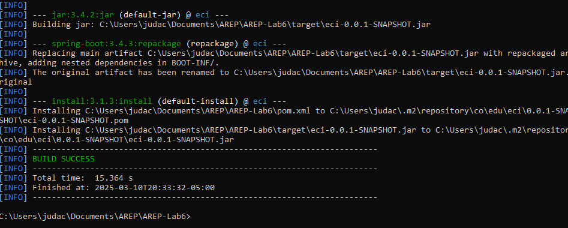
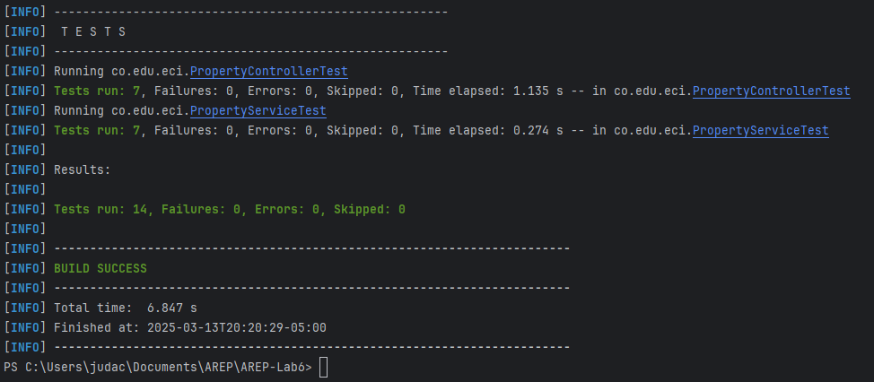

# Taller 6 | AREP

## Secure Application Design

In this project, we will design and deploy a secure web application using AWS infrastructure. The system consists of two main components:

- Apache Server (Frontend): Serves an asynchronous HTML+JavaScript client over a secure TLS connection, ensuring encrypted communication.
- Spring Boot Server (Backend): Provides RESTful API endpoints, also secured with TLS, to handle client requests and authentication.

The entire application is deployed on AWS, with each service running on separate EC2 instances. TLS certificates from Let’s Encrypt are used to encrypt all data transmissions. The login system is implemented with hashed password storage, ensuring user data security. This architecture prioritizes scalability, security, and best practices for cloud deployment.

## Architecture

The architecture of this project follows a distributed deployment model using AWS EC2 instances. It consists of three main components:

- Browser: Users interact with the system through a web browser, sending requests to the web application.
- WebApplication: A Spring Boot application runs inside a Docker container on a EC2 instance, handling business logic, processing user requests, and communicating with the database.
- Database: A MySQL database runs inside a Docker container on a separate EC2 instance, storing and managing property data.


## Class Design

```
src/
  main/
    java/
      co/
        edu/
          eci/
            controller/
              PropertyController.java
            model/
              Property.java
            repository/
              PropertyRepository.java
            service/
              PropertyService.java
            SecureWeb.java                      # Clase principal
    resources/
        images/                                 # Recursos para el archivo Readme
        keystore/            
            keystore.p12
        application.properties
  test/
    java/
      co/
        edu/
          eci/
            PropertyControllerTest.java         # Pruebas Unitarias
pom.xml
README.md
```

## Getting Started

These instructions will allow you to get a working copy of the project on your local machine for development and testing purposes.

### Prerequisites

- [Java](https://www.oracle.com/co/java/technologies/downloads/) 21 or higher.
- [Maven](https://maven.apache.org/download.cgi). 3.8.1 o higher.
- [Docker](https://www.docker.com/products/docker-desktop/). Latest
- [AWS](https://aws.amazon.com/). Account
- [Git](https://git-scm.com/downloads) (optional).
- Web Browser.

To check if installed, run:

```
java -version
```
```
mvn --version
```
```
docker --version
```
```
git --version
```

### Installing

1. Download the repository from GitHub in a .zip or clone it to your local machine using Git.

    ```
    git clone https://github.com/jcontreras2693/AREP-Lab6.git
    ```

2. Navigate to the project directory.

    ```
    cd AREP-Lab6
    ```

3. Build the project by running the following command:

    ```
    mvn clean install
    ```

   

## Deployment

1. Create a default EC2 instance on AWS and add a new Security Rule on the Security Group of the instance.

   

2. Connect to the EC2 instance, install docker with these commands:

    ```
    sudo yum update -y
    sudo yum install docker
    ```

3. Create and install a MySQL image on Docker, this will be our Database:

    ```
    docker run --name mysql-container -e MYSQL_ROOT_PASSWORD=root -e MYSQL_DATABASE=properties_db -p 3306:3306 -d mysql
    ```

4. You can get into the database in the container (password: root) with the command:

    ```
    docker exec -it mysql-container mysql -u root -p
    ```

5. Exit the connection and replace this line in the application.properties file:

    ```
    spring.datasource.url=jdbc:mysql://your-EC2-public-IP:3306/properties_db
    ```

6. Compile and generate the .jar files again with the following command:

    ```
    mvn clean package
    ```
7. Create a new default EC2 instance on AWS and add a new Security Rule on the Security Group of the instance.:

    

8. Load the .jar file generated into the EC2 with the command:

    ```
    scp -i "SecondKey.pem" eci-0.0.1-SNAPSHOT.jar ec2-user@ec2-44-201-240-221.compute-1.amazonaws.com:/home/ec2-user/
    ```

9. Connect to the EC2 instance using ssh:

    ```
    ssh -i "tu-llave.pem" ec2-user@ec2-44-201-240-221.compute-1.amazonaws.com
    ```

10. Install java 17 and execute the .jar file using the following command:

    ```
    sudo yum intsall java-17
    java -jar eci-0.0.1-SNAPSHOT.jar
    ```

    

11. Create a last default EC2 instance on AWS and add a new Security Rule on the Security Group of the instance.

   

12. Get static domains using [Duck DNS](https://www.duckdns.org) for the EC2 applications, the one that will host Apache and the one that will host the Application, we need to use their public ip4 ips:

    

13. Load the static files into the EC2 with the command:

    ```
    scp -i "SecondKey.pem" index.html ec2-user@ec2-44-201-240-221.compute-1.amazonaws.com:/home/ec2-user/
    scp -i "SecondKey.pem" styles.css ec2-user@ec2-44-201-240-221.compute-1.amazonaws.com:/home/ec2-user/
    scp -i "SecondKey.pem" script.js ec2-user@ec2-44-201-240-221.compute-1.amazonaws.com:/home/ec2-user/
    ```

14. Connect to the EC2 instance using ssh:

    ```
    ssh -i "tu-llave.pem" ec2-user@ec2-44-201-240-221.compute-1.amazonaws.com
    ```

15. Install Apache and start the service using the following command:

    ```
    sudo yum install httpd -y
    sudo systemctl start httpd
    sudo systemctl enable httpd
    ```
    
16. Move the static files to the folder '/var/www/html' so Apache could load them, in the script.js the url should be using https protocol and the domain given by Duck DNS to the EC2 that hosts the application:

    ```
    sudo mv index.html /var/www/html
    sudo mv styles.css /var/www/html
    sudo mv script.js /var/www/html
    ```

17. Create a Virtual Host for Apache with these commands:

    ```
    sudo nano /etc/httpd/conf.d/tu-dominio.conf
    ```

18. Add this to the file:

    ```
    <VirtualHost *:443>
        ServerName taller6arep.duckdns.org
        ServerAlias www.taller6arep.duckdns.org
        DocumentRoot /var/www/html
        Redirect permanent / https://taller6arep.duckdns.org/
        
        <Directory /var/www/html>
            AllowOverride All
            Require all granted
        </Directory>
        
        RewriteEngine on
        RewriteCond %{SERVER_NAME} =taller6arep.duckdns.org [OR]
        RewriteCond %{SERVER_NAME} =www.taller6arep.duckdns.org
        RewriteRule ^ https://%{SERVER_NAME}%{REQUEST_URI} [END,NE,R=permanent]
    </VirtualHost>
    ```

19. Restart Apache with the command:

    ```
    sudo systemctl enable httpd
    ```

## HTTPS Certificates Generation

1. Once 


## Application Running

- GET Request example.

  

- GET Request example by ID.

  

- POST Request example.

  

- PUT Request example.

  

- DELETE Request example.

  

## Running the Tests

The tests performed verify the getters and setters of the Pokémon class, the PokemonController GET and POST actions and the Concurrency on PokemonServer.

To run the tests from the console, use the following command:

```
mvn test
```

If the tests were successful, you will see a message like this in your command console.



## Built With

* [Java Development Kit](https://www.oracle.com/co/java/technologies/downloads/) - Software Toolkit
* [Maven](https://maven.apache.org/) - Dependency Management
* [Git](https://git-scm.com/) - Distributed Version Control System

## Authors

* **Juan David Contreras Becerra** - *Taller 6 | AREP* - [AREP-Lab6](https://github.com/jcontreras2693/AREP-Lab6.git)